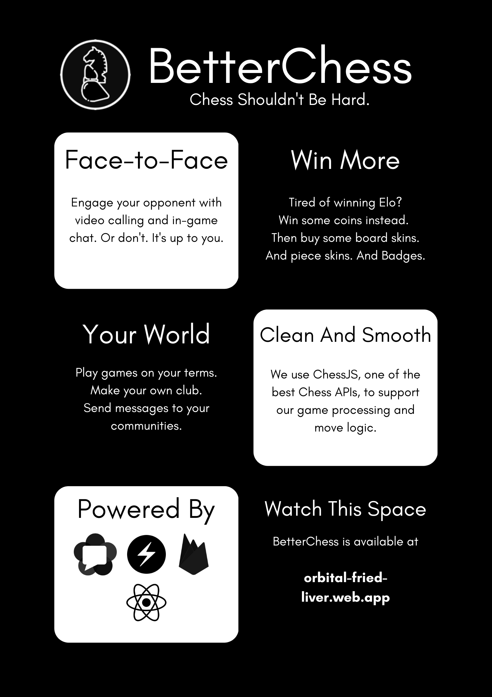
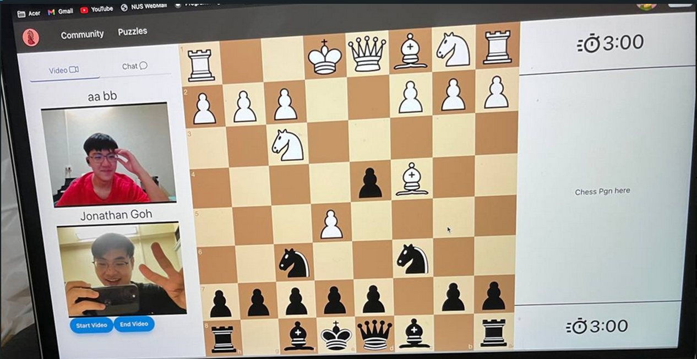
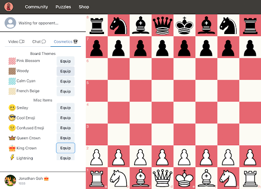

# BetterChess 🏆

 

**Orbital 2022 - Apollo 11 Level Achievement**  
**Team "Fried Liver"** - Ezra Tio & Jonathan Goh

---

## 🎯 What Is BetterChess?

BetterChess is a modern, community-focused chess platform designed to revolutionize how players connect, compete, and grow together. Built with React and Firebase, our platform addresses the limitations of existing chess sites by emphasizing social interaction, community building, and meaningful rewards.

This project means a lot to be as my introduction ot full-stack development as someone who has been playing chess for the past 18 years :)

 
*Screenshot 1: Live picture of us working on the project!*

### 🌟 Key Features

- **🎮 Real-time Multiplayer Chess** with multiple time controls (Blitz, Rapid, Classical)
- **📹 Integrated Video Calling** for face-to-face gameplay experience
- **💬 In-game Chat System** for real-time communication
- **🏘️ Club Creation & Management** for building chess communities
- **🛍️ Reward System & Shop** with cosmetic upgrades and badges
- **⏱️ Synchronized Turn-based Timer** with server-side accuracy
- **🎨 Customizable Board Themes** and player cosmetics
- **📊 ELO Rating System** with coin rewards
- **🔐 Secure Authentication** via Firebase (Email/Google)

---

 
*Screenshot 2: Rich customzsation options for users while playing*

---

## 🛠️ Tech Stack

| Category | Technology |
|----------|------------|
| **Frontend** | React, Chakra-UI, Framer Motion |
| **Backend** | Firebase, Firestore Real-time Database |
| **Authentication** | Firebase Auth (Email/Google) |
| **Game Logic** | Chess.js, ChessboardJSX |
| **Video Calling** | WebRTC, STUN/TURN servers |
| **Testing** | Jest, Cypress, React Testing Library |
| **Version Control** | Git, GitHub |

---

## 🎮 Core Features

### 🔐 Authentication System
- **Multi-provider Support**: Email/password and Google OAuth
- **Secure Sessions**: Firebase-managed user sessions with "Remember Me"
- **User Feedback**: Dynamic error handling and success notifications

### ♟️ Chess Game Engine
- **Real-time Multiplayer**: Synchronized gameplay using Firestore
- **Multiple Time Controls**: Blitz (5min), Rapid (10min), Classical (15min)
- **Move Validation**: Chess.js library ensures legal moves
- **PGN Support**: Portable Game Notation sidebar for move tracking

### 🏘️ Community Features
- **Club Creation**: Simple form-based club setup with name, location, description
- **Club Discovery**: Browse and join existing clubs with member counts
- **Message Boards**: Club-specific messaging with real-time updates
- **Member Management**: Dynamic membership tracking and notifications

### 🛍️ Shop & Rewards System
- **Coin Economy**: Earn coins by winning games, spend on cosmetics
- **Board Themes**: Multiple color schemes for personalized gameplay
- **Player Badges**: Cosmetic icons visible to opponents
- **Real-time Updates**: Instant inventory and coin balance synchronization

### 📹 Video Calling Integration
- **WebRTC Implementation**: Peer-to-peer video connections
- **STUN/TURN Servers**: Google STUN + OpenRelay TURN for connectivity
- **In-game Integration**: Seamless video chat during matches
- **Privacy Controls**: Camera/microphone permission management

### 💬 Communication Tools
- **In-game Chat**: Real-time messaging during matches
- **Club Messaging**: Community discussion boards
- **Message Persistence**: Chat history stored in Firestore

--- 

## 🎯 User Stories

1. **Chess Enthusiast**: "I want interactive online games with video calling for a more personal experience"
2. **Club Facilitator**: "I need tools to organize competitions and manage members easily"
3. **Anxious Player**: "I want to practice against adjustable AI before facing real opponents"
4. **Community Builder**: "I want to create local chess communities with easy communication tools"
5. **Competitive Player**: "I want tangible rewards beyond just ELO ratings"

---

## 🧪 Testing Strategy

### Unit Testing (Jest)
- Component rendering validation
- Game logic functions (ELO calculation, timer formatting)
- Authentication flow testing

### End-to-End Testing (Cypress)
- Complete user journey simulation
- Multi-user game scenarios
- Cross-browser compatibility

### User Testing
- **Methodology**: 5-user moderated testing sessions
- **Success Rate**: 60-100% across different tasks
- **Key Findings**: UI improvements for personal challenges, message board UX

---

## 📈 Performance & Scalability

### Database Optimization
- **Minimal Requests**: Server timestamps reduce database calls
- **Real-time Sync**: Firestore snapshots for instant updates
- **Data Structure**: Optimized document schemas for quick queries

### Video Call Performance
- **P2P Connections**: Direct browser-to-browser communication
- **Adaptive Quality**: Automatic adjustment based on connection
- **Fallback Servers**: TURN servers for restricted networks

---

---

## 🏆 Achievement Level

**Apollo 11** - This project demonstrates:
- Complex real-time multiplayer architecture
- Advanced WebRTC implementation
- Comprehensive testing strategy
- Firebase integration
- Modern React development practices
- User-centered design approach

---

